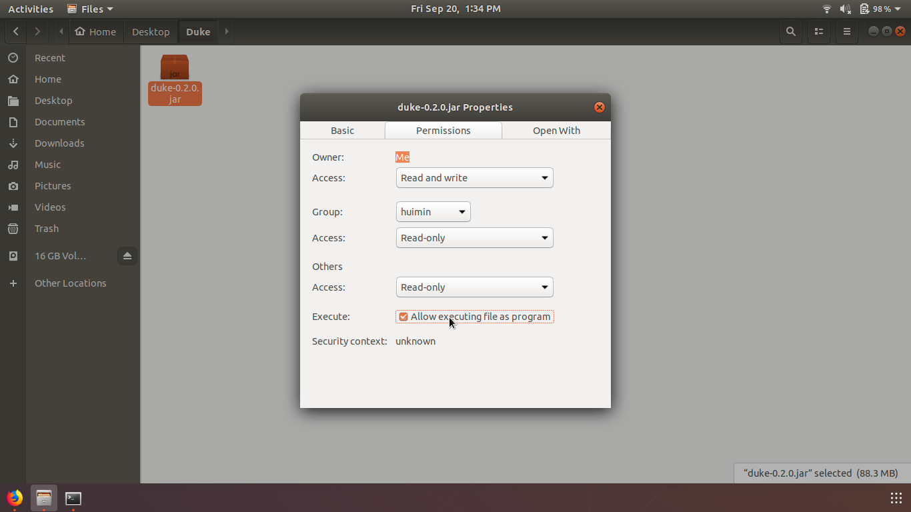
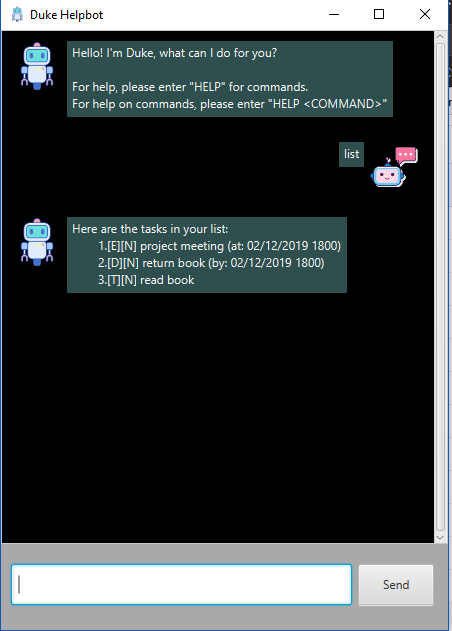
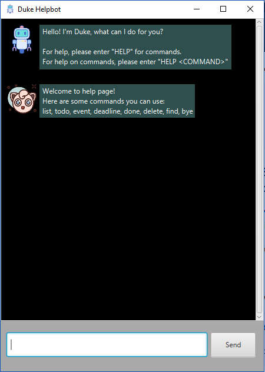
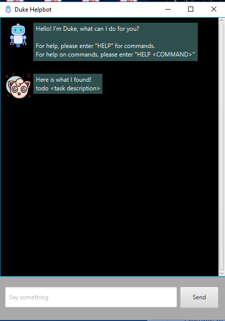
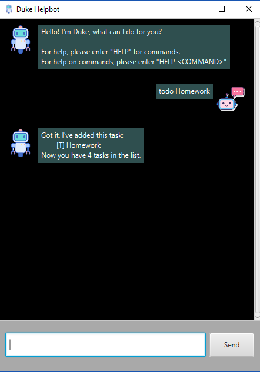
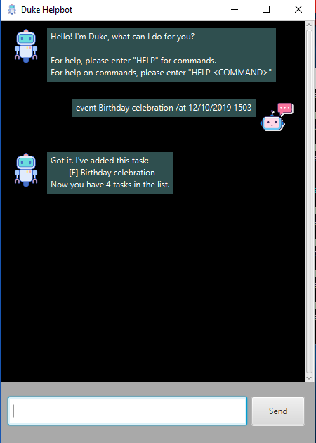
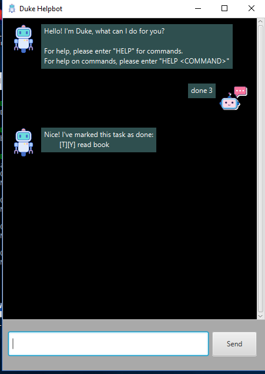
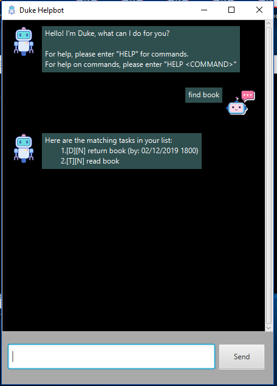
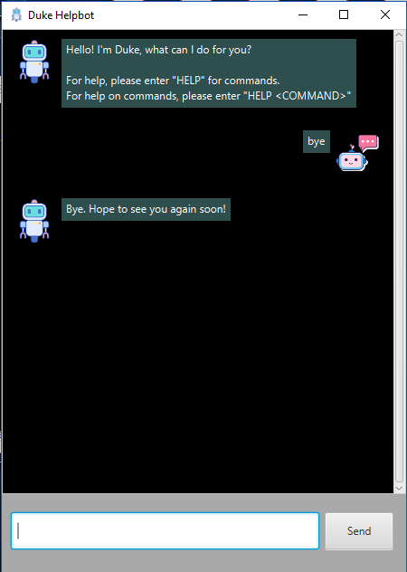

# User Guide

Duke is a personal chat bot that uses the CLI to manage daily tasks. It is a case insensitve CLI application.

## Quick Start

### Computing Environment

Duke GUI has been tested and possible to run on Windows and Linux given the following computing environment
* openjdk 11.0.4
* OpenJDK Runtime Environment Build 11.0.4

For Linux, please enter `java --version` to check if the minimum Java requirement is met before running the GUI application.
For Windows, please enter `java --version` to check if the minimum Java requirement is met before running the GUI application.

#### Start Duke Helpbot

* Download the Duke Helpbot from [release page](https://github.com/huiminlim/duke/releases/tag/A-Release).

#### For Linux, 
* Go to the download location folder. You will see the `duke-0.2.0.jar` file. 
* Right click the `duke-0.2.0.jar` file and click on `properties`. 

* Check the `Allow executing file as program` box.

* Double click the `duke-0.2.0.jar` file to execute the Duke Helpbot GUI. 

Alternatively, a command can be issued in the command terminal: `java -jar duke-0.2.0.jar`.

#### For Windows,
* Go to the download location folder. You will see the `duke-0.2.0.jar` file. 
* Double click the `duke-0.2.0.jar` file to execute the Duke Helpbot GUI. 

Alternatively, a command can be issued in the command terminal: `java -jar duke-0.2.0.jar`.


## Features 

Duke allows users to track three types of task - To Do, Deadline and Events. In addition, there are also various utility functions to allow the user to manage his/her task list. These functions include `list`, `delete`, `done`, `bye`, `help`, `find`.

For all To Do, Deadline and Events, a task description is shown in chronological order in which they were added. The classification of the To Do, Deadline and Events are denoted by a task icon, as shown in table below.

Task | Task icon
------------ | -------------
To Do | T
Deadline | D
Event | E

The completion status is also denoted by a completion icon, as shown in the table below.

Completion Status | Completion icon
------------ | -------------
Completed | Y
Incomplete | N


A sample list with the Task Icon and Completion Status is show below


## Usage

### `list` - List out all tasks 

A list of all the To Do, Deadline and Events are shown to the user.

For Deadlines, the date and time in which the task is due is included in the same line after the task description.
For Events, the date and time in which the task is happening is included in the same line after the task description.

Example of usage: 

`list`
  

Example of expected outcome:

```
Here are the tasks in your list:
1.[E][N] project meeting (by: 02/12/2019 1420)
2.[D][N] return book (by: 02/12/2019 1420)
3.[T][N] read book
```

A sample Duke Helpbot response can be seen below.




  
### `help` - Show help page to assist user in commands available

Shows the various commands that the Duke chat bot uses in the application. 
  
  
Example of usage: 

`help`
  
Example of expected outcome:
```
Welcome to help page!
Here are some commands you can use:
list, todo, event, deadline, done, delete, find, bye
```

A sample Duke Helpbot response can be seen below.



  
The user can further check the syntax required of each command to use it, by supplying the command interested.
  
Example of usage: 

`help todo`
  
Example of expected outcome:

```
Here is what I found!
todo <task description>
```
A sample Duke Helpbot response can be seen below.




  
### `todo` - Adds a To Do task to the task list.

The user can add a To Do task that has no deadline to the task list.
  
Example of usage: 
  
`todo Homework`
  
Example of expected outcome:

```
Got it. I've added this task:
  [T] Homework
Now you have 5 tasks in the list.
```
A sample Duke Helpbot response can be seen below.



  
### `event` - Adds an Event to the task list.

The user can add an Event to the task list to track any event that he/she may have in his/her schedule. The event requires a date and time to be furnished with the event description.
  

Example of usage: 
  
`event Birthday celebration /at 12/10/2019 1503`
  
Example of expected outcome:
```
Got it. I've added this task:
  [E] Birthday celebration
Now you have 5 tasks in the list.
```

A sample Duke Helpbot response can be seen below.




### `deadline` - Adds an task with deadline to the task list.

The user can add a task with a deadline to the task list to track any deadlines he/she has. The deadline requires a date and time to be furnished with the deadline task description.

Example of usage:  

`deadline CS2103 IP /by 12/10/2019 1503`

Example of expected outcome:

```
Got it. I've added this task:
  [D] CS2103 IP
Now you have 5 tasks in the list.
```

A sample Duke Helpbot response can be seen below.


### `done` - Sets a task as completed.

The user can update the completion status of the task to done. The user needs to identify the task to be set as done with the task number, by checking the task list.

Example of usage: 

`done 4`

Example of expected outcome:

```
Nice! I've marked this task as done:
  [D][Y] CS2103 IP (by: 12/10/2019 1123)
```
A sample Duke Helpbot response can be seen below.




### `delete` - Deletes a task in task list.

The user can delete a specific task from the task list. The user needs to identify the task to be deleted with the task number, by checking the task list.

Example of usage: 

`delete 1`

Example of expected outcome:

```
Noted. I've removed this task:
  [E][N] CS2103 IP (by: 12/10/2019 1123)
```

A sample Duke Helpbot response can be seen below.


### `find` - Finds all the task with the matching keyword in the task description.

The user can find all the task entries in the task list, in which the task description contains the specified keyword. 

Example of usage: 

`find book`

Example of expected outcome:

```
Here are the matching tasks in your list:
  1.[D][N] return book (by: 12/10/2019 1123)
  2.[Y][N] read book
```

A sample Duke Helpbot response can be seen below.




### `bye` - To exit and stop Duke.

To stop the session with Duke, the user can specify this command to end the session with Duke.

Example of usage: 

`bye`

Example of expected outcome:

```
Bye. Hope to see you again soon!
```

A sample Duke Helpbot response can be seen below.


